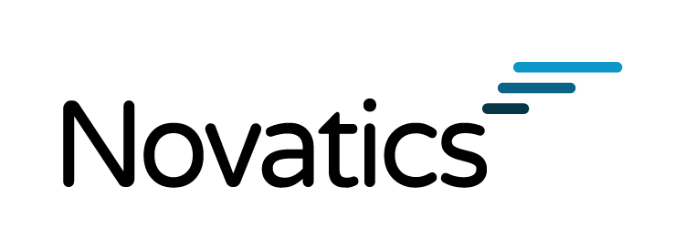

# Novafacer

[](https://www.novatics.com.br/)


# Introdução

Setindo a necessidade de capacitar nosso membros na área de inteligiência artifical que cresce cada vez mais. Os desenvolvedores da Novatics elaboraram este primeiro projeto utilizando Visão Computacional para iniciar soluções utilizando IA.

Novafacer é uma solução utilizando Opencv, cujo objetivo inicial foi identificar em tempo real, utilizando uma câmera, cada membro da Novatics ao entrar no escritório e apresentar uma simples frase com o respectivo nome do membro.

A seguir iremos mostrar o passo a passo de como instalar as bibliotecas e como executar o projeto.

# Instalação

O primeiro passo a ser feito é instalar o **Python** em seu sistema operacional. Vale lembrar que você poderá optar por utilizar a versão do Python 3 ou Python 2:

- Caso use MacOS, acesse esse [link](https://python-guide-pt-br.readthedocs.io/pt_BR/latest/starting/install3/osx.html) para seguir o tutorial de instalação.

- Caso use Linux, acesse esse [link](https://python.org.br/instalacao-linux/) para seguir o tutorial de instalação.

Após a instalação do **Python**, você deverá instalar o **Pip**, que funciona como o gerenciador de pacotes para o **Python**:

- Caso use MacOS, acesse esse [link](https://python.org.br/instalacao-mac/) para seguir o tutorial de instalação.

- Caso use Linux, acesse esse [link](https://sempreupdate.com.br/como-instalar-o-pip-no-ubuntu/) para seguir o tutorial de instalação.

Após isso, iremos instalar o **OpenCV**:

```bash
pip install opencv-python ou pip3 install opencv-python
```

Depois iremos instalar a bibliteca **Imutils**, biblioteca para facilitar manipulações com imagens:

```bash
pip install --upgrade imutils ou pip3 install --upgrade imutils
```

Depois precisamos instalar o **Scikit-learn**, biblioteca de Machine Learning:

```bash
pip install scikit-learn ou pip3 install scikit-learn
```

- Após isso, precisamos baixar a biblioteca **dlib**, para instalar essa biblioteca exige um pouco mais de esforço, para isso pode se acessar esse [link](http://pyimagesearch.com/2017/03/27/how-to-install-dlib/) para concluir a instalação.

Agora o último passa é realizar a instalação do **OpenFace**, que é o responsável pelo algoritmo de reconhecimento facial:

```bash
pip install git+https://github.com/cmusatyalab/openface.git ou pip3 install git+https://github.com/cmusatyalab/openface.git
```

# Como executar

Para rodar o projeto você precisará realizar os seguintes passos:

1. Colocar as imagens das pessoas que queira que seja reconhecida na pasta de **imagens**. Quanto mais imagens, melhor a precisão do algoritmo, mas um uso mínimo de 10 imagens deve ser o suficiente para se ter um primeiro resultado. As imagens devem ser colocadas em uma sub pasta com o nome da pessoa a ser identificada.

2. Além da pessoas que desejam ser reconhecidas é importante ter uma pasta identificada como **unknown** para que o algoritmo de reconhecimento seja treinado também com exemplos de pessoas diferentes.

Agora com as imagens em seus devidos lugares basta o rodos o seguinte comando para iniciar o treinamento do projeto:

```bash
python train.py —dataset images ou python3 train.py —dataset images
```

Ao terminar o treinamento, basta rodar o seguinte comando para executar o projeto:

```bash
python recognize.py —format video ou python3 recognize.py —format video
```
